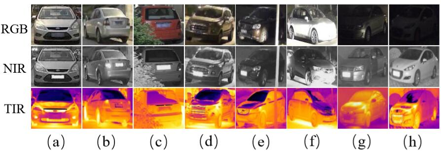
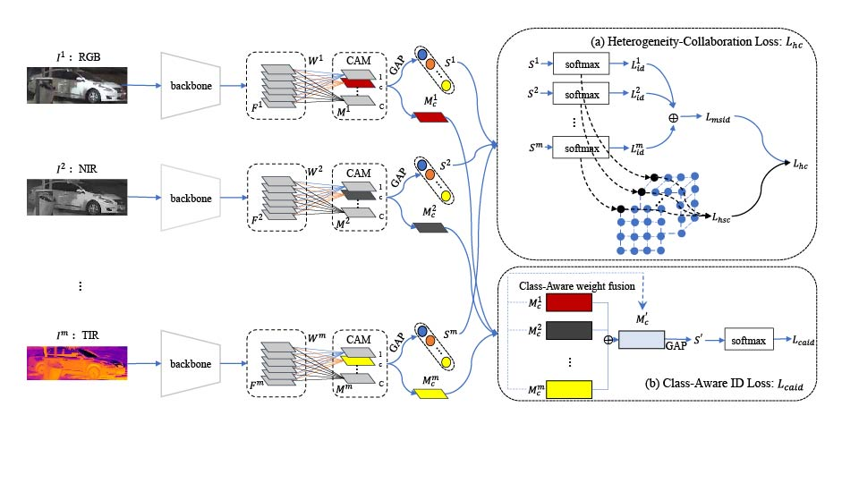

# Multi-spectral Vehicle Re-identification: A Challenge
## Dataset
In this work, we address the RGB and IR vehicle Re-ID problem and contribute a multi-spectral vehicle Re-ID benchmark named RGBN300, including RGB and NIR (Near Infrared) vehicle images of 300 identities from 8 camera views, giving in total 50125 RGB images and 50125 NIR images respectively. In addition, we have acquired additional TIR (Thermal Infrared) data for 100 vehicles from RGBN300 to form another dataset for three-spectral vehicle Re-ID. 

RGBN300
link：https://pan.baidu.com/s/1uiKcqiqdhd13nLSW8TUASg 
Extraction code：11y8 

RGBNT100
link：https://pan.baidu.com/s/1xqqh7N4Lctm3RcUdskG0Ug 
Extraction code：rjin

## HAMNet
### Pipeline

### Get Started

The designed architecture follows this guide PyTorch-Project-Template, you can check each folder's purpose by yourself. The codes are expanded on a [ReID-baseline](https://github.com/L1aoXingyu/reid_baseline). 

1.`cd` to folder where you want to download this repo

2.Run `git clone https://github.com/ttaalle/multi-modal-vehicle-Re-ID.git`

3.Install dependencies:
* pytorch>=0.4
* torchvision
* ignite=0.1.2
* yacs 

4.Prepare Pretraining model on Imagenet

for example /home/——/.torch/models/resnet50-19c8e357.pth

5.Prepare dataset

Create a directory to store reid datasets under this repo or outside this repo. Remember to set your path to the root of the dataset in config/defaults.py for all training and testing or set in every single config file in configs/ or set in every single command.

You can create a directory to store reid datasets under this repo via

`cd multi-modal-vehicle-Re-ID

mkdir data`

To propose a stronger baseline, this version has been added bag of tricks(Random erasing augmentation, Label smoothing and BNNeck) as [Strong ReID-baseline](https://github.com/michuanhaohao/reid-strong-baseline).

